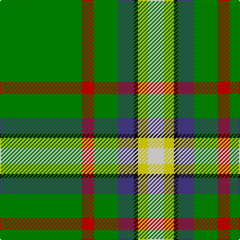

The parent of this is [Decatur Presbyterian Church](/tartans/g/82/r12/g24/b16/k4/y10/w/16/)

This was sourced from register-of-tartans.  It is a [7 stripes tartan](/stripes/stripes7/).

Original link https://www.tartanregister.gov.uk/tartanDetails.aspx?ref=10163

## Thread count
G/82 R12 G24 B16 K4 Y10 W/16

## Palette
Each colour and its ΔE from the base-6 reference it is a variant of.

| Colour | Shade | Base | ΔE (OKLab) |
|---|---|---|---|
| B |  `#473C8B` | B  | 0.04 |
| G |  `#008B00` | G  | 0.12 |
| K |  `#101010` | K  | 0.17 |
| R |  `#CD0000` | R  | 0.01 |
| W |  `#FFFFFF` | W  | 0.03 |
| Y |  `#FFE600` | Y  | 0.10 |

# Sample pattern

ID: /variants/g/82/r12/g24/b16/k4/y10/w/16-b473c8b-g008b00-k101010-rcd0000-wffffff-yffe600/
