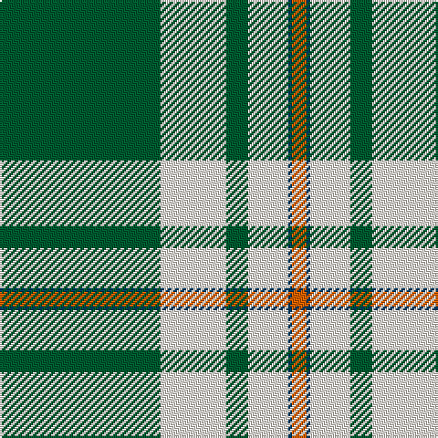

The parent of this is [Westfalia German Corporate Tartan Tartan Number: 7523. Earliest known date: June 2002 A worsted scarf for a German dairy machinery company. Woven sample. See products available Copyright © Blair Urquhart, Comrie, 2015](/tartans/g/88/ly36/g12/ly22/db2/o/8/)

This was sourced from house-of-tartan.  It is a [6 stripes tartan](/stripes/stripes6/).

Original link http://www.house-of-tartan.scotland.net/house/TartanViewjs.asp?colr=Def&tnam=7523

## Thread count
G/88 LY36 G12 LY22 DB2 O/8

## Palette
Each colour and its ΔE from the base-6 reference it is a variant of.

| Colour | Shade | Base | ΔE (OKLab) |
|---|---|---|---|
| DB |  `#003C64` | B  | 0.07 |
| G |  `#005C30` | G  | 0.05 |
| LY |  `#F8F0E4` | W  | 0.02 |
| O |  `#E86000` | R  | 0.14 |

# Sample pattern

ID: /variants/g/88/ly36/g12/ly22/db2/o/8-db003c64-g005c30-lyf8f0e4-oe86000/
