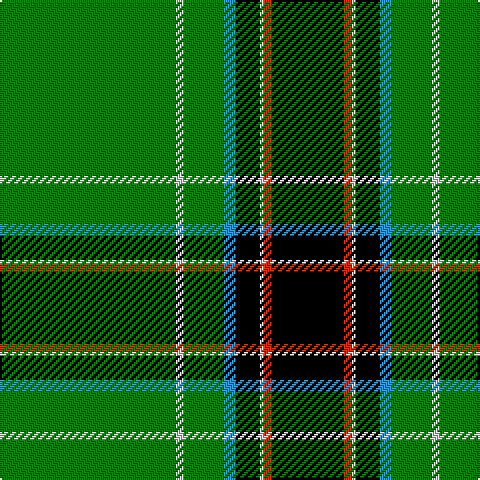

The parent of this is [Mull Rugby Club (Sports)](/tartans/g/88/n4/g20/b6/k12/n2/r4/k/36/)

This was sourced from tartans-authority.  It is a [8 stripes tartan](/stripes/stripes8/).

Original link http://www.tartansauthority.com/tartan-ferret/display/5648/

## Thread count
G/88 N4 G20 B6 K12 N2 R4 K/36

## Palette
Each colour and its ΔE from the base-6 reference it is a variant of.

| Colour | Shade | Base | ΔE (OKLab) |
|---|---|---|---|
| B |  `#288CC8` | B  | 0.23 |
| G |  `#007800` | G  | 0.06 |
| K |  `#000000` | K  | 0.00 |
| N |  `#C8C8C8` | W  | 0.13 |
| R |  `#C82800` | R  | 0.03 |

# Sample pattern

ID: /variants/g/88/n4/g20/b6/k12/n2/r4/k/36-b288cc8-g007800-k000000-nc8c8c8-rc82800/
