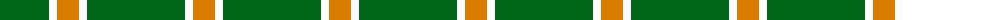
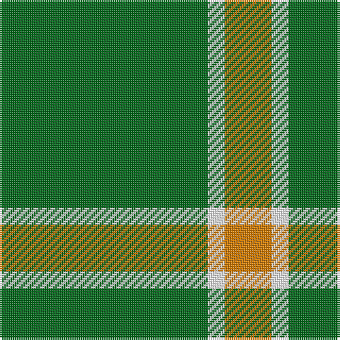

The parent of this is [Hibernian S3](/tartans/g/98/w8/o/22/)

This was sourced from tartans-authority.  It is a [3 stripes tartan](/stripes/stripes3/).

Original link http://www.tartansauthority.com/tartan-ferret/display/11043/

## Thread count
G/98 W8 O/22

## Palette
Each colour and its ΔE from the base-6 reference it is a variant of.

| Colour | Shade | Base | ΔE (OKLab) |
|---|---|---|---|
| G |  `#006818` | G  | 0.02 |
| O |  `#D87C00` | Y  | 0.17 |
| W |  `#FCFCFC` | W  | 0.03 |

# Sample pattern

ID: /variants/g/98/w8/o/22-g006818-od87c00-wfcfcfc/
