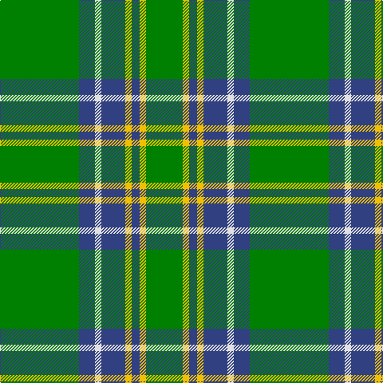

The parent of this is [Duke of York, hunting](/tartans/g/99/b20/ln8/b30/y8/b10/y8/g/46/)

This was sourced from weddslist.  It is a [8 stripes tartan](/stripes/stripes8/).

Original link http://www.weddslist.com/cgi-bin/tartans/pg.pl?source=sts

## Thread count
G/99 B20 LN8 B30 Y8 B10 Y8 G/46

## Palette
Each colour and its ΔE from the base-6 reference it is a variant of.

| Colour | Shade | Base | ΔE (OKLab) |
|---|---|---|---|
| B |  `#304080` | B  | 0.01 |
| G |  `#008000` | G  | 0.09 |
| LN |  `#E0E0E0` | W  | 0.06 |
| Y |  `#F0C000` | Y  | 0.01 |

# Sample pattern

ID: /variants/g/99/b20/ln8/b30/y8/b10/y8/g/46-b304080-g008000-lne0e0e0-yf0c000/
