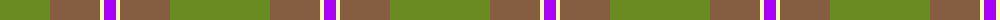
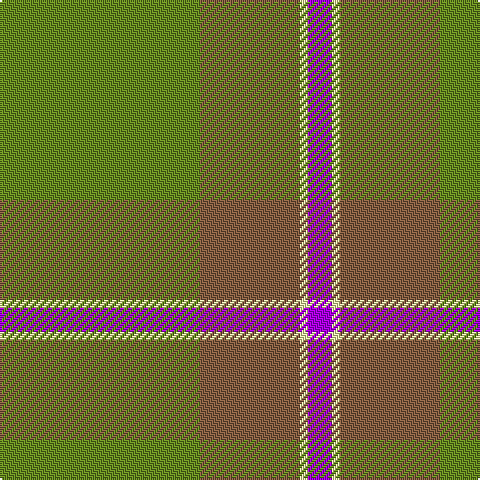

The parent of this is [Highland Greenford (Personal)](/tartans/ga/100/lt50/ly4/p/12/)

This was sourced from register-of-tartans.  It is a [4 stripes tartan](/stripes/stripes4/).

Original link https://www.tartanregister.gov.uk/tartanDetails.aspx?ref=10498

## Thread count
Ga/100 LT50 LY4 P/12

## Palette
Each colour and its ΔE from the base-6 reference it is a variant of.

| Colour | Shade | Base | ΔE (OKLab) |
|---|---|---|---|
| G |  `#698B22` | G  | 0.16 |
| Ga |  `#698B22` | G  | 0.16 |
| LT |  `#855E42` | R  | 0.16 |
| LY |  `#FFFFAA` | W  | 0.10 |
| P |  `#AA00FF` | B  | 0.29 |

# Sample pattern

ID: /variants/ga/100/lt50/ly4/p/12-g698b22-ga698b22-lt855e42-lyffffaa-paa00ff/
