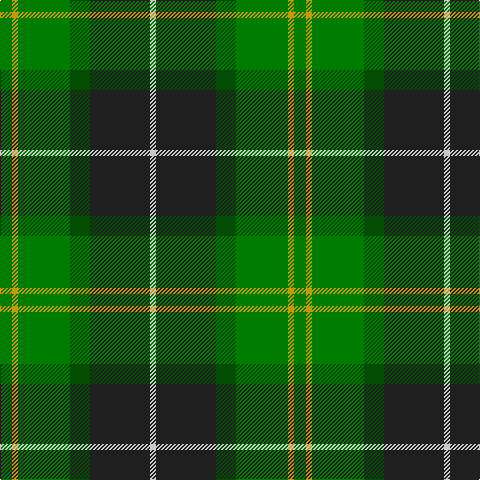

The parent of this is [Wcwm 1716](/tartans/ga/12/dy6/ga52/g20/k60/n/6/)

This was sourced from register-of-tartans.  It is a [6 stripes tartan](/stripes/stripes6/).

Original link https://www.tartanregister.gov.uk/tartanDetails.aspx?ref=4543

## Thread count
Ga/12 DY6 Ga52 G20 K60 N/6

## Palette
Each colour and its ΔE from the base-6 reference it is a variant of.

| Colour | Shade | Base | ΔE (OKLab) |
|---|---|---|---|
| DY |  `#C89800` | Y  | 0.12 |
| G |  `#004C00` | G  | 0.08 |
| Ga |  `#007C00` | G  | 0.08 |
| K |  `#202020` | B  | 0.19 |
| N |  `#C8C8C8` | W  | 0.13 |

# Sample pattern

ID: /variants/ga/12/dy6/ga52/g20/k60/n/6-dyc89800-g004c00-ga007c00-k202020-nc8c8c8/
