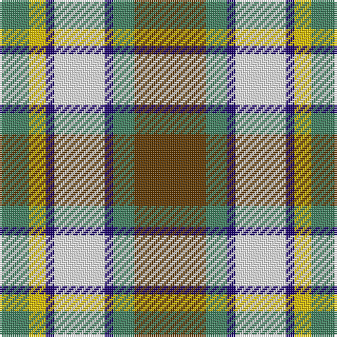

The parent of this is [Northern Ontario](/tartans/ga/14/y8/db4/wa24/db4/ga10/t/34/)

This was sourced from register-of-tartans.  It is a [7 stripes tartan](/stripes/stripes7/).

Original link https://www.tartanregister.gov.uk/tartanDetails.aspx?ref=3161

## Thread count
Ga/14 Y8 DB4 Wa24 DB4 Ga10 T/34

## Palette
Each colour and its ΔE from the base-6 reference it is a variant of.

| Colour | Shade | Base | ΔE (OKLab) |
|---|---|---|---|
| B |  `#1474B4` | B  | 0.15 |
| DB |  `#1C0070` | B  | 0.14 |
| DBa |  `#2C2C80` | B  | 0.05 |
| DY |  `#D09800` | Y  | 0.11 |
| G |  `#006818` | G  | 0.02 |
| Ga |  `#408060` | G  | 0.13 |
| T |  `#603800` | G  | 0.16 |
| W |  `#FCFCFC` | W  | 0.03 |
| Wa |  `#F8F8F8` | W  | 0.01 |
| Y |  `#E8C000` | Y  | 0.00 |

# Sample pattern

ID: /variants/ga/14/y8/db4/wa24/db4/ga10/t/34-b1474b4-db1c0070-dba2c2c80-dyd09800-g006818-ga408060-t603800-wfcfcfc-waf8f8f8-ye8c000/
