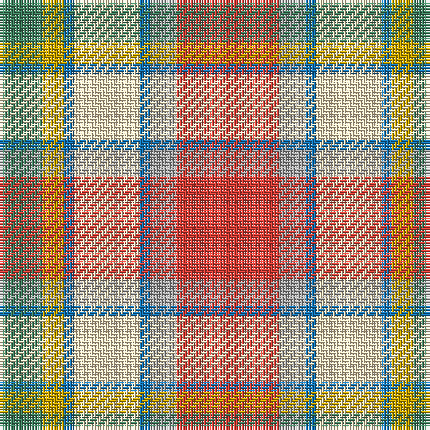

The parent of this is [Ontario, Northern](/tartans/ga/16/dy8/b4/w24/b4/n10/r/38/)

This was sourced from register-of-tartans.  It is a [7 stripes tartan](/stripes/stripes7/).

Original link https://www.tartanregister.gov.uk/tartanDetails.aspx?ref=3255

## Thread count
Ga/16 DY8 B4 W24 B4 N10 R/38

## Palette
Each colour and its ΔE from the base-6 reference it is a variant of.

| Colour | Shade | Base | ΔE (OKLab) |
|---|---|---|---|
| B |  `#1474B4` | B  | 0.15 |
| DB |  `#1C0070` | B  | 0.14 |
| DY |  `#C8A400` | Y  | 0.09 |
| G |  `#006818` | G  | 0.02 |
| Ga |  `#408060` | G  | 0.13 |
| N |  `#A0A0A0` | Y  | 0.20 |
| R |  `#DC4038` | R  | 0.08 |
| T |  `#603800` | G  | 0.16 |
| W |  `#F8E4BC` | W  | 0.07 |

# Sample pattern

ID: /variants/ga/16/dy8/b4/w24/b4/n10/r/38-b1474b4-db1c0070-dyc8a400-g006818-ga408060-na0a0a0-rdc4038-t603800-wf8e4bc/
