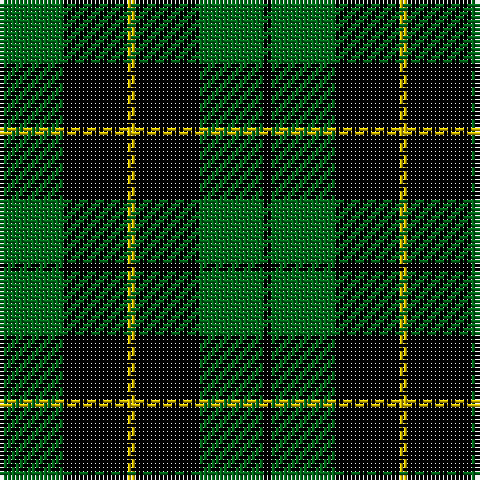

The parent of this is [Wallace Hunting](/tartans/ga/16/k16/y2/k16/ga16/k/2/)

This was sourced from register-of-tartans.  It is a [6 stripes tartan](/stripes/stripes6/).

Original link https://www.tartanregister.gov.uk/tartanDetails.aspx?ref=4486

## Thread count
Ga/16 K16 Y2 K16 Ga16 K/2

## Palette
Each colour and its ΔE from the base-6 reference it is a variant of.

| Colour | Shade | Base | ΔE (OKLab) |
|---|---|---|---|
| DG |  `#004028` | G  | 0.14 |
| G |  `#289C18` | G  | 0.18 |
| Ga |  `#006818` | G  | 0.02 |
| K |  `#000000` | K  | 0.00 |
| Y |  `#DCBC00` | Y  | 0.02 |

# Sample pattern

ID: /variants/ga/16/k16/y2/k16/ga16/k/2-dg004028-g289c18-ga006818-k000000-ydcbc00/
