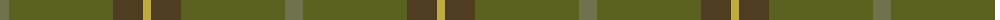

The parent of this is [McGuigan, Julia (St Monans, Fife Name Tartan Tartan Number: 10605. Earliest known date: 16/01/2012 Inspired by the MacNeil of Colonsay tartan (STR ref #2688), as the surname McGuigan is considered a sept of MacNeil of Colonsay and Gigha. Using the green, red and white stripes of the MacNeil of Colonsay tartan, the colours have been toned down to create a softer palette. See products available Copyright © Blair Urquhart, Comrie, 2015](/tartans/ga/18/g104/t30/o/8/)

This was sourced from house-of-tartan.  It is a [4 stripes tartan](/stripes/stripes4/).

Original link http://www.house-of-tartan.scotland.net/house/TartanViewjs.asp?colr=Def&tnam=10605

## Thread count
Ga/18 G104 T30 O/8

## Palette
Each colour and its ΔE from the base-6 reference it is a variant of.

| Colour | Shade | Base | ΔE (OKLab) |
|---|---|---|---|
| G |  `#5A601E` | G  | 0.09 |
| Ga |  `#70714D` | G  | 0.15 |
| O |  `#BFAB40` | Y  | 0.09 |
| T |  `#4E3D20` | G  | 0.15 |

# Sample pattern

ID: /variants/ga/18/g104/t30/o/8-g5a601e-ga70714d-obfab40-t4e3d20/
