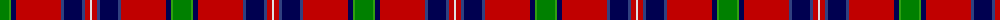

The parent of this is [MacNiven](/tartans/ga/18/g2/db5/r45/b3/db18/b3/r5/ln/2/)

This was sourced from weddslist.  It is a [9 stripes tartan](/stripes/stripes9/).

Original link http://www.weddslist.com/cgi-bin/tartans/pg.pl?source=sts

## Thread count
Ga/18 G2 DB5 R45 B3 DB18 B3 R5 LN/2

## Palette
Each colour and its ΔE from the base-6 reference it is a variant of.

| Colour | Shade | Base | ΔE (OKLab) |
|---|---|---|---|
| B |  `#304080` | B  | 0.01 |
| DB |  `#000050` | B  | 0.20 |
| G |  `#30A010` | G  | 0.19 |
| Ga |  `#008000` | G  | 0.09 |
| LN |  `#E0E0E0` | W  | 0.06 |
| R |  `#C00000` | R  | 0.02 |

ID: /variants/ga/18/g2/db5/r45/b3/db18/b3/r5/ln/2-b304080-db000050-g30a010-ga008000-lne0e0e0-rc00000/
