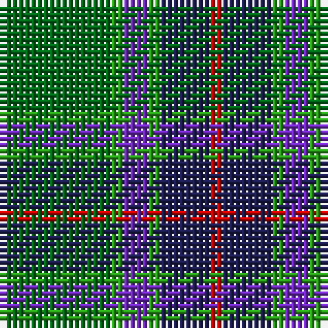

The parent of this is [Gorman, George (Personal)](/tartans/ga/18/g2/p4/g2/db8/r/2/)

This was sourced from tartans-authority.  It is a [6 stripes tartan](/stripes/stripes6/).

Original link http://www.tartansauthority.com/tartan-ferret/display/10029/

## Thread count
Ga/18 G2 P4 G2 DB8 R/2

## Palette
Each colour and its ΔE from the base-6 reference it is a variant of.

| Colour | Shade | Base | ΔE (OKLab) |
|---|---|---|---|
| DB |  `#1C1C50` | B  | 0.14 |
| G |  `#289C18` | G  | 0.18 |
| Ga |  `#006818` | G  | 0.02 |
| P |  `#7028C0` | B  | 0.15 |
| R |  `#C80000` | R  | 0.00 |

# Sample pattern

ID: /variants/ga/18/g2/p4/g2/db8/r/2-db1c1c50-g289c18-ga006818-p7028c0-rc80000/
