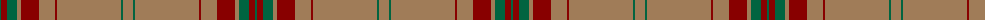

The parent of this is [Portosalvo (Corporate)](/tartans/ga/2/dr6/g6/ga4/lt4/dr18/lt16/dr2/lt64/ga2/lt/10/)

This was sourced from tartans-authority.  It is a [11 stripes tartan](/stripes/stripes11/).

Original link http://www.tartansauthority.com/tartan-ferret/display/10328/

## Thread count
Ga/2 DR6 G6 Ga4 LT4 DR18 LT16 DR2 LT64 Ga2 LT/10

## Palette
Each colour and its ΔE from the base-6 reference it is a variant of.

| Colour | Shade | Base | ΔE (OKLab) |
|---|---|---|---|
| DR |  `#880000` | R  | 0.14 |
| G |  `#006440` | G  | 0.06 |
| Ga |  `#006440` | G  | 0.06 |
| LT |  `#A07C58` | R  | 0.19 |

ID: /variants/ga/2/dr6/g6/ga4/lt4/dr18/lt16/dr2/lt64/ga2/lt/10-dr880000-g006440-ga006440-lta07c58/
