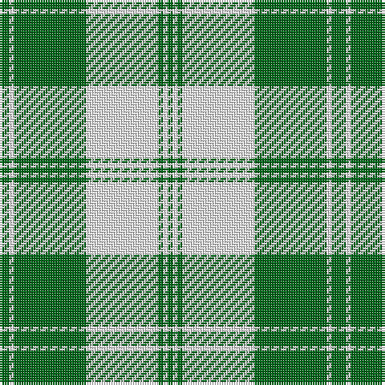

The parent of this is [Bundy, Dress Black Personal)](/tartans/ga/2/g2/w2/g30/w30/g2/w2/ga/2/)

This was sourced from tartans-authority.  It is a [8 stripes tartan](/stripes/stripes8/).

Original link http://www.tartansauthority.com/tartan-ferret/display/9000/

## Thread count
Ga/2 G2 W2 G30 W30 G2 W2 Ga/2

## Palette
Each colour and its ΔE from the base-6 reference it is a variant of.

| Colour | Shade | Base | ΔE (OKLab) |
|---|---|---|---|
| G |  `#006818` | G  | 0.02 |
| Ga |  `#006818` | G  | 0.02 |
| W |  `#F8F8F8` | W  | 0.01 |

# Sample pattern

ID: /variants/ga/2/g2/w2/g30/w30/g2/w2/ga/2-g006818-ga006818-wf8f8f8/
