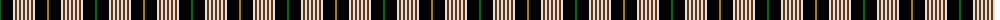

The parent of this is [Alliance of Border Scots](/tartans/ga/2/k12/ln2/t2/ln2/t2/ln2/t2/ln2/t2/ln2/t2/ln2/k12/lg2/k12/ln2/t2/ln2/t2/ln2/t2/ln2/t2/ln2/t2/ln2/k12/ga/2/)

This was sourced from register-of-tartans.  It is a [29 stripes tartan](/stripes/stripes29/).

Original link https://www.tartanregister.gov.uk/tartanDetails.aspx?ref=5079

## Thread count
Ga/2 K12 LN2 T2 LN2 T2 LN2 T2 LN2 T2 LN2 T2 LN2 K12 LG2 K12 LN2 T2 LN2 T2 LN2 T2 LN2 T2 LN2 T2 LN2 K12 Ga/2

## Palette
Each colour and its ΔE from the base-6 reference it is a variant of.

| Colour | Shade | Base | ΔE (OKLab) |
|---|---|---|---|
| G |  `#184800` | G  | 0.09 |
| Ga |  `#006818` | G  | 0.02 |
| K |  `#000000` | K  | 0.00 |
| LG |  `#9C8000` | G  | 0.21 |
| LN |  `#E0E0E0` | W  | 0.06 |
| N |  `#ACACAC` | Y  | 0.18 |
| T |  `#64340C` | G  | 0.18 |
| W |  `#F8F8F8` | W  | 0.01 |

ID: /variants/ga/2/k12/ln2/t2/ln2/t2/ln2/t2/ln2/t2/ln2/t2/ln2/k12/lg2/k12/ln2/t2/ln2/t2/ln2/t2/ln2/t2/ln2/t2/ln2/k12/ga/2-g184800-ga006818-k000000-lg9c8000-lne0e0e0-nacacac-t64340c-wf8f8f8/
