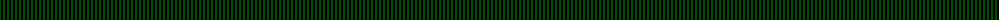
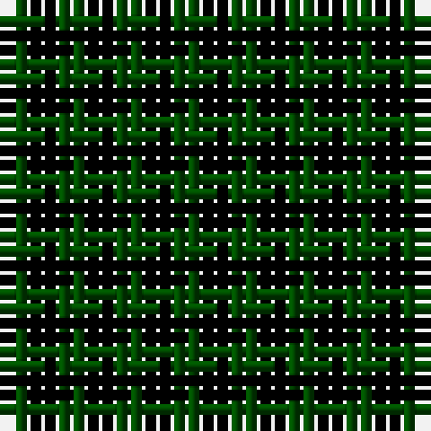

The parent of this is [Ballindalloch (Estate Check)](/tartans/ga/2/k2/g2/k2/g2/k2/g2/k/2/)

This was sourced from tartans-authority.  It is a [8 stripes tartan](/stripes/stripes8/).

Original link http://www.tartansauthority.com/tartan-ferret/display/3641/

## Thread count
Ga/2 K2 G2 K2 G2 K2 G2 K/2

## Palette
Each colour and its ΔE from the base-6 reference it is a variant of.

| Colour | Shade | Base | ΔE (OKLab) |
|---|---|---|---|
| G |  `#004C00` | G  | 0.08 |
| Ga |  `#004C00` | G  | 0.08 |
| K |  `#000000` | K  | 0.00 |

# Sample pattern

ID: /variants/ga/2/k2/g2/k2/g2/k2/g2/k/2-g004c00-ga004c00-k000000/
