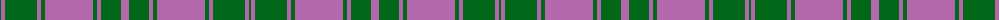

The parent of this is [Hilton Hotel Hong Kong (Corporate)](/tartans/ga/2/pa4/gb32/pa4/gb4/pa48/g4/pa4/g20/p/8/)

This was sourced from tartans-authority.  It is a [10 stripes tartan](/stripes/stripes10/).

Original link http://www.tartansauthority.com/tartan-ferret/display/3940/

## Thread count
Ga/2 Pa4 Gb32 Pa4 Gb4 Pa48 G4 Pa4 G20 P/8

## Palette
Each colour and its ΔE from the base-6 reference it is a variant of.

| Colour | Shade | Base | ΔE (OKLab) |
|---|---|---|---|
| G |  `#006818` | G  | 0.02 |
| Ga |  `#006818` | G  | 0.02 |
| Gb |  `#006818` | G  | 0.02 |
| P |  `#B468AC` | R  | 0.21 |
| Pa |  `#B468AC` | R  | 0.21 |

ID: /variants/ga/2/pa4/gb32/pa4/gb4/pa48/g4/pa4/g20/p/8-g006818-ga006818-gb006818-pb468ac-pab468ac/
