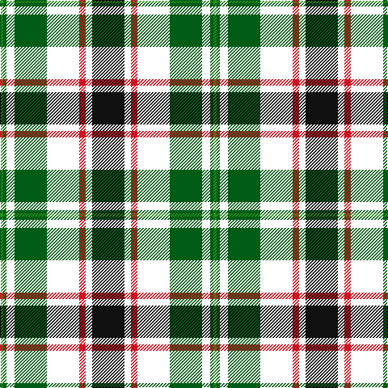

The parent of this is [Hackett, William (Coatbridge) (Personal)](/tartans/ga/4/g4/w10/g40/w40/r8/w8/k/40/)

This was sourced from register-of-tartans.  It is a [8 stripes tartan](/stripes/stripes8/).

Original link https://www.tartanregister.gov.uk/tartanDetails.aspx?ref=10530

## Thread count
Ga/4 G4 W10 G40 W40 R8 W8 K/40

## Palette
Each colour and its ΔE from the base-6 reference it is a variant of.

| Colour | Shade | Base | ΔE (OKLab) |
|---|---|---|---|
| G |  `#015C16` | G  | 0.03 |
| Ga |  `#278F1C` | G  | 0.14 |
| K |  `#101010` | K  | 0.17 |
| R |  `#CE1422` | R  | 0.02 |
| W |  `#FFFFFF` | W  | 0.03 |

# Sample pattern

ID: /variants/ga/4/g4/w10/g40/w40/r8/w8/k/40-g015c16-ga278f1c-k101010-rce1422-wffffff/
