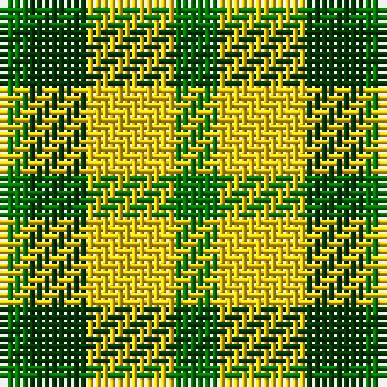

The parent of this is [Pilgrims School, Bedford (Corporate)](/tartans/ga/4/g8/y12/ga/6/)

This was sourced from tartans-authority.  It is a [4 stripes tartan](/stripes/stripes4/).

Original link http://www.tartansauthority.com/tartan-ferret/display/5503/

## Thread count
Ga/4 G8 Y12 Ga/6

## Palette
Each colour and its ΔE from the base-6 reference it is a variant of.

| Colour | Shade | Base | ΔE (OKLab) |
|---|---|---|---|
| G |  `#003800` | G  | 0.15 |
| Ga |  `#007800` | G  | 0.06 |
| Y |  `#FCCC00` | Y  | 0.04 |

# Sample pattern

ID: /variants/ga/4/g8/y12/ga/6-g003800-ga007800-yfccc00/
