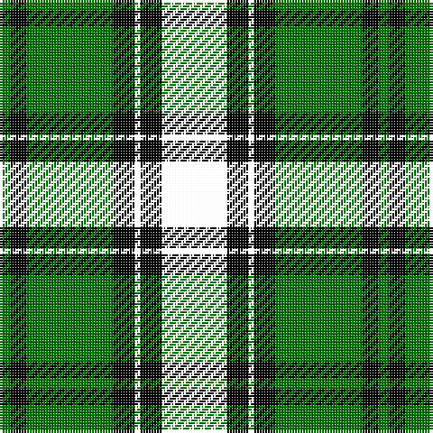

The parent of this is [Arundel County (District)](/tartans/ga/4/k6/g32/k8/y2/k8/a10/r/4/)

This was sourced from tartans-authority.  It is a [8 stripes tartan](/stripes/stripes8/).

Original link http://www.tartansauthority.com/tartan-ferret/display/4149/

## Thread count
Ga/4 K6 G32 K8 Y2 K8 A10 R/4

## Palette
Each colour and its ΔE from the base-6 reference it is a variant of.

| Colour | Shade | Base | ΔE (OKLab) |
|---|---|---|---|
| G |  `#007800` | G  | 0.06 |
| Ga |  `#007800` | G  | 0.06 |
| K |  `#000000` | K  | 0.00 |

# Sample pattern

ID: /variants/ga/4/k6/g32/k8/y2/k8/a10/r/4-g007800-ga007800-k000000/
