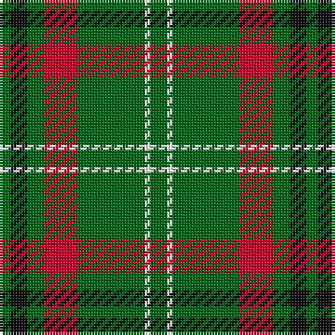

The parent of this is [Arkansas State American District Tartan Tartan Number: 2678. Earliest known date: 1998 The official Arkansas state tartan. At one time there were two other contenders for this honour but this database only has details of one other - # 3264. Green represents the "Natural State" (the State's nickname), red the original settlers, white for the diamonds and black for the rich oil reserves. Approved by State Governor Mike Huckabee in the State Captal of Little Rock on 1st September, 1998. See products available Copyright © Blair Urquhart, Comrie, 2015](/tartans/ga/4/k6/ga6/r12/ga24/w2/ga/6/)

This was sourced from house-of-tartan.  It is a [7 stripes tartan](/stripes/stripes7/).

Original link http://www.house-of-tartan.scotland.net/house/TartanViewjs.asp?colr=Def&tnam=2678

## Thread count
Ga/4 K6 Ga6 R12 Ga24 W2 Ga/6

## Palette
Each colour and its ΔE from the base-6 reference it is a variant of.

| Colour | Shade | Base | ΔE (OKLab) |
|---|---|---|---|
| G |  `#285800` | G  | 0.04 |
| Ga |  `#006818` | G  | 0.02 |
| Gb |  `#289C18` | G  | 0.18 |
| K |  `#101010` | K  | 0.17 |
| R |  `#C8002C` | R  | 0.03 |
| W |  `#FCFCFC` | W  | 0.03 |

# Sample pattern

ID: /variants/ga/4/k6/ga6/r12/ga24/w2/ga/6-g285800-ga006818-gb289c18-k101010-rc8002c-wfcfcfc/
