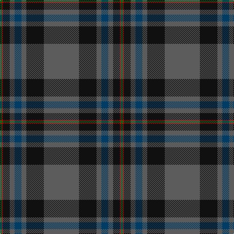

The parent of this is [Suttle (Personal)](/tartans/ga/4/r2/k14/n10/db14/n10/k36/n/72/)

This was sourced from register-of-tartans.  It is a [8 stripes tartan](/stripes/stripes8/).

Original link https://www.tartanregister.gov.uk/tartanDetails.aspx?ref=5671

## Thread count
Ga/4 R2 K14 N10 DB14 N10 K36 N/72

## Palette
Each colour and its ΔE from the base-6 reference it is a variant of.

| Colour | Shade | Base | ΔE (OKLab) |
|---|---|---|---|
| DB |  `#003C64` | B  | 0.07 |
| G |  `#289C18` | G  | 0.18 |
| Ga |  `#006818` | G  | 0.02 |
| K |  `#101010` | K  | 0.17 |
| N |  `#5C5C5C` | B  | 0.14 |
| R |  `#C80000` | R  | 0.00 |

# Sample pattern

ID: /variants/ga/4/r2/k14/n10/db14/n10/k36/n/72-db003c64-g289c18-ga006818-k101010-n5c5c5c-rc80000/
