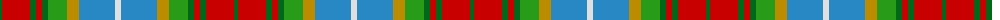

The parent of this is [Derry Family (Personal)](/tartans/ga/4/r28/ga6/r6/ga6/g19/dy12/b36/ln/6/)

This was sourced from tartans-authority.  It is a [9 stripes tartan](/stripes/stripes9/).

Original link http://www.tartansauthority.com/tartan-ferret/display/10377/

## Thread count
Ga/4 R28 Ga6 R6 Ga6 G19 DY12 B36 LN/6

## Palette
Each colour and its ΔE from the base-6 reference it is a variant of.

| Colour | Shade | Base | ΔE (OKLab) |
|---|---|---|---|
| B |  `#2888C4` | B  | 0.21 |
| DY |  `#BC8C00` | Y  | 0.16 |
| G |  `#289C18` | G  | 0.18 |
| Ga |  `#006818` | G  | 0.02 |
| LN |  `#E0E0E0` | W  | 0.06 |
| R |  `#C80000` | R  | 0.00 |

ID: /variants/ga/4/r28/ga6/r6/ga6/g19/dy12/b36/ln/6-b2888c4-dybc8c00-g289c18-ga006818-lne0e0e0-rc80000/
