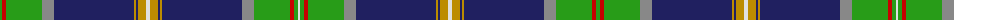

The parent of this is [O'Mahony, The](/tartans/ga/4/r4/ga36/nb12/db80/dy2/db2/dy8/ln4/dy8/db2/dy2/db80/nb12/ga36/r4/ga4/ln/2/)

This was sourced from register-of-tartans.  It is a [18 stripes tartan](/stripes/stripes18/).

Original link https://www.tartanregister.gov.uk/tartanDetails.aspx?ref=3244

## Thread count
Ga/4 R4 Ga36 Nb12 DB80 DY2 DB2 DY8 LN4 DY8 DB2 DY2 DB80 Nb12 Ga36 R4 Ga4 LN/2

## Palette
Each colour and its ΔE from the base-6 reference it is a variant of.

| Colour | Shade | Base | ΔE (OKLab) |
|---|---|---|---|
| DB |  `#202060` | B  | 0.11 |
| DBa |  `#2C2C80` | B  | 0.05 |
| DY |  `#BC8C00` | Y  | 0.16 |
| G |  `#006818` | G  | 0.02 |
| Ga |  `#289C18` | G  | 0.18 |
| K |  `#101010` | K  | 0.17 |
| LN |  `#E0E0E0` | W  | 0.06 |
| N |  `#C0C0C0` | W  | 0.16 |
| Na |  `#5C5C5C` | B  | 0.14 |
| Nb |  `#888888` | R  | 0.24 |
| R |  `#C80000` | R  | 0.00 |

ID: /variants/ga/4/r4/ga36/nb12/db80/dy2/db2/dy8/ln4/dy8/db2/dy2/db80/nb12/ga36/r4/ga4/ln/2-db202060-dba2c2c80-dybc8c00-g006818-ga289c18-k101010-lne0e0e0-nc0c0c0-na5c5c5c-nb888888-rc80000/
