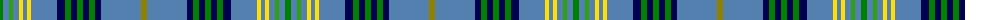

The parent of this is [Fermanagh](/tartans/ga/6/b6/g4/b6/y4/b4/y4/b26/db8/ga6/db6/ga6/db6/ga6/db6/b40/lg/6/)

This was sourced from weddslist.  It is a [17 stripes tartan](/stripes/stripes17/).

Original link http://www.weddslist.com/cgi-bin/tartans/pg.pl?source=sts

## Thread count
Ga/6 B6 G4 B6 Y4 B4 Y4 B26 DB8 Ga6 DB6 Ga6 DB6 Ga6 DB6 B40 LG/6

## Palette
Each colour and its ΔE from the base-6 reference it is a variant of.

| Colour | Shade | Base | ΔE (OKLab) |
|---|---|---|---|
| B |  `#5480B0` | B  | 0.20 |
| DB |  `#000050` | B  | 0.20 |
| G |  `#30A010` | G  | 0.19 |
| Ga |  `#008000` | G  | 0.09 |
| LG |  `#908000` | G  | 0.19 |
| Y |  `#FFE000` | Y  | 0.09 |

ID: /variants/ga/6/b6/g4/b6/y4/b4/y4/b26/db8/ga6/db6/ga6/db6/ga6/db6/b40/lg/6-b5480b0-db000050-g30a010-ga008000-lg908000-yffe000/
