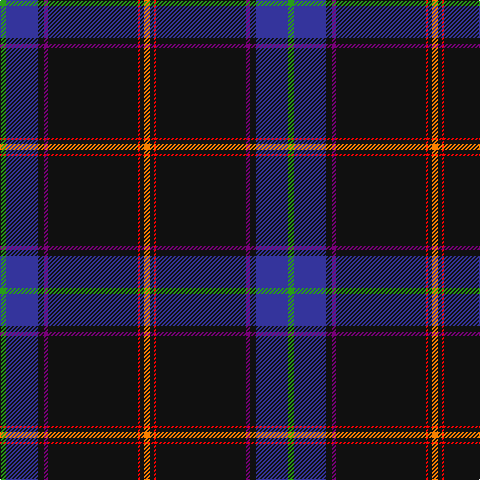

The parent of this is [Cumnock District Tartan Tartan Number: 10436. Earliest known date: March 2011 Based on the MacMillan hunting tartan in honour of the founder of the Cumnock Games, Councillor James McMillan. The blue is from the lion rampant in the Cumnock coat of arms. The orange and red commemorate the great iron ore blast furnaces at Lugar and the surrounding black is for the coal mines that fed those furnaces and formed the heart of the Cumnock community. Approved by Cumnock Community Council. See products available Copyright © Blair Urquhart, Comrie, 2015](/tartans/ga/6/ba32/k6/p4/k90/r2/k4/o/6/)

This was sourced from house-of-tartan.  It is a [8 stripes tartan](/stripes/stripes8/).

Original link http://www.house-of-tartan.scotland.net/house/TartanViewjs.asp?colr=Def&tnam=10436

## Thread count
Ga/6 Ba32 K6 P4 K90 R2 K4 O/6

## Palette
Each colour and its ΔE from the base-6 reference it is a variant of.

| Colour | Shade | Base | ΔE (OKLab) |
|---|---|---|---|
| B |  `#1474B4` | B  | 0.15 |
| Ba |  `#34349C` | B  | 0.05 |
| DB |  `#1C0070` | B  | 0.14 |
| DR |  `#880000` | R  | 0.14 |
| DY |  `#D09800` | Y  | 0.11 |
| G |  `#00841C` | G  | 0.10 |
| Ga |  `#289C18` | G  | 0.18 |
| K |  `#101010` | K  | 0.17 |
| LN |  `#E0E0E0` | W  | 0.06 |
| O |  `#F88000` | Y  | 0.15 |
| P |  `#780078` | B  | 0.16 |
| R |  `#F80000` | R  | 0.10 |

# Sample pattern

ID: /variants/ga/6/ba32/k6/p4/k90/r2/k4/o/6-b1474b4-ba34349c-db1c0070-dr880000-dyd09800-g00841c-ga289c18-k101010-lne0e0e0-of88000-p780078-rf80000/
