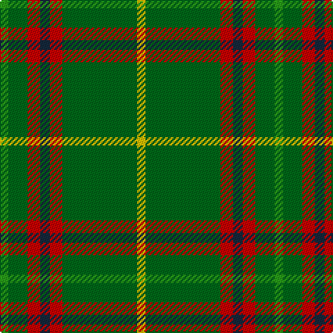

The parent of this is [Tulloch Homes](/tartans/ga/6/g14/r9/dn7/r9/g54/y/6/)

This was sourced from register-of-tartans.  It is a [7 stripes tartan](/stripes/stripes7/).

Original link https://www.tartanregister.gov.uk/tartanDetails.aspx?ref=4154

## Thread count
Ga/6 G14 R9 DN7 R9 G54 Y/6

## Palette
Each colour and its ΔE from the base-6 reference it is a variant of.

| Colour | Shade | Base | ΔE (OKLab) |
|---|---|---|---|
| DN |  `#14283C` | B  | 0.14 |
| G |  `#006818` | G  | 0.02 |
| Ga |  `#289C18` | G  | 0.18 |
| R |  `#C80000` | R  | 0.00 |
| Y |  `#E8C000` | Y  | 0.00 |

# Sample pattern

ID: /variants/ga/6/g14/r9/dn7/r9/g54/y/6-dn14283c-g006818-ga289c18-rc80000-ye8c000/
