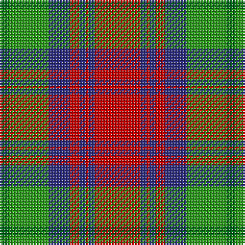

The parent of this is [Cranston Dress (Clan)](/tartans/ga/6/g26/db14/r6/db4/r2/db4/r/30/)

This was sourced from tartans-authority.  It is a [8 stripes tartan](/stripes/stripes8/).

Original link http://www.tartansauthority.com/tartan-ferret/display/753/

## Thread count
Ga/6 G26 DB14 R6 DB4 R2 DB4 R/30

## Palette
Each colour and its ΔE from the base-6 reference it is a variant of.

| Colour | Shade | Base | ΔE (OKLab) |
|---|---|---|---|
| DB |  `#2C2C80` | B  | 0.05 |
| G |  `#289C18` | G  | 0.18 |
| Ga |  `#006818` | G  | 0.02 |
| R |  `#C80000` | R  | 0.00 |

# Sample pattern

ID: /variants/ga/6/g26/db14/r6/db4/r2/db4/r/30-db2c2c80-g289c18-ga006818-rc80000/
