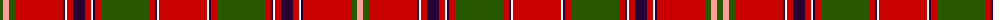

The parent of this is [King George IV](/tartans/ga/6/lr6/ga6/r48/dp2/w2/r6/dp12/r6/w2/dp2/r6/ga48/r6/dp2/w2/r48/w2/dp2/r6/ga48/r6/dp2/w2/r6/dp12/r6/w2/dp2/r48/ga6/lr/6/)

This was sourced from register-of-tartans.  It is a [32 stripes tartan](/stripes/stripes32/).

Original link https://www.tartanregister.gov.uk/tartanDetails.aspx?ref=1983

## Thread count
Ga/6 LR6 Ga6 R48 DP2 W2 R6 DP12 R6 W2 DP2 R6 Ga48 R6 DP2 W2 R48 W2 DP2 R6 Ga48 R6 DP2 W2 R6 DP12 R6 W2 DP2 R48 Ga6 LR/6

## Palette
Each colour and its ΔE from the base-6 reference it is a variant of.

| Colour | Shade | Base | ΔE (OKLab) |
|---|---|---|---|
| DP |  `#280034` | B  | 0.21 |
| G |  `#006818` | G  | 0.02 |
| Ga |  `#285800` | G  | 0.04 |
| LR |  `#FCA098` | Y  | 0.17 |
| N |  `#C8C8C8` | W  | 0.13 |
| R |  `#C80000` | R  | 0.00 |
| W |  `#F8F8F8` | W  | 0.01 |

ID: /variants/ga/6/lr6/ga6/r48/dp2/w2/r6/dp12/r6/w2/dp2/r6/ga48/r6/dp2/w2/r48/w2/dp2/r6/ga48/r6/dp2/w2/r6/dp12/r6/w2/dp2/r48/ga6/lr/6-dp280034-g006818-ga285800-lrfca098-nc8c8c8-rc80000-wf8f8f8/
