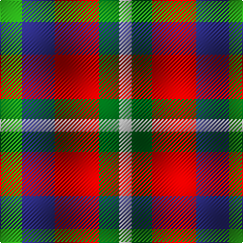

The parent of this is [Nicolson of Taransay (Personal)](/tartans/gb/10/gb8/g4/db32/r44/ga20/ln/12/)

This was sourced from tartans-authority.  It is a [7 stripes tartan](/stripes/stripes7/).

Original link http://www.tartansauthority.com/tartan-ferret/display/7828/

## Thread count
Gb/10 Gb8 G4 DB32 R44 Ga20 LN/12

## Palette
Each colour and its ΔE from the base-6 reference it is a variant of.

| Colour | Shade | Base | ΔE (OKLab) |
|---|---|---|---|
| DB |  `#2C2C80` | B  | 0.05 |
| G |  `#289C18` | G  | 0.18 |
| Ga |  `#006818` | G  | 0.02 |
| Gb |  `#289C18` | G  | 0.18 |
| LN |  `#E0E0E0` | W  | 0.06 |
| R |  `#C80000` | R  | 0.00 |

# Sample pattern

ID: /variants/gb/10/gb8/g4/db32/r44/ga20/ln/12-db2c2c80-g289c18-ga006818-gb289c18-lne0e0e0-rc80000/
