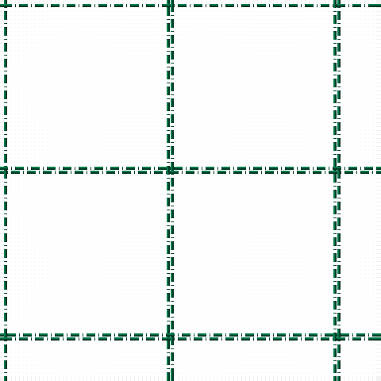

The parent of this is [Stirling of Keir](/tartans/gb/2/dr20/dwr20/gb/2/)

This was sourced from register-of-tartans.  It is a [4 stripes tartan](/stripes/stripes4/).

Original link https://www.tartanregister.gov.uk/tartanDetails.aspx?ref=5774

## Thread count
Gb/2 DR20 DWR20 Gb/2

## Palette
Each colour and its ΔE from the base-6 reference it is a variant of.

| Colour | Shade | Base | ΔE (OKLab) |
|---|---|---|---|
| B |  `#487CB8` | B  | 0.19 |
| Ba |  `#105088` | B  | 0.05 |
| DB |  `#2C2C80` | B  | 0.05 |
| G |  `#006818` | G  | 0.02 |
| Ga |  `#449020` | G  | 0.15 |
| Gb |  `#006840` | G  | 0.06 |
| K |  `#101010` | K  | 0.17 |
| LN |  `#E0E0E0` | W  | 0.06 |

# Sample pattern

ID: /variants/gb/2/dr20/dwr20/gb/2-b487cb8-ba105088-db2c2c80-g006818-ga449020-gb006840-k101010-lne0e0e0/
