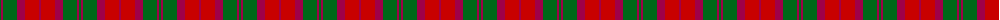
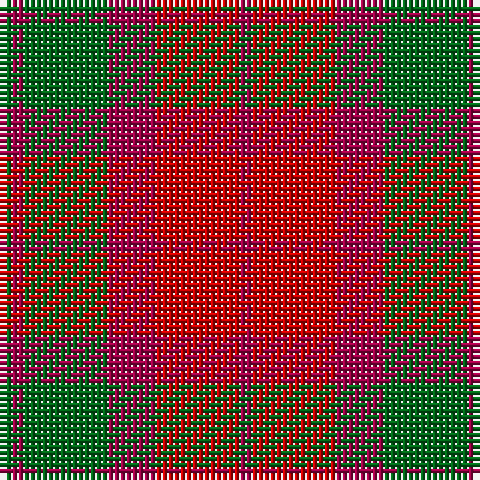

The parent of this is [MacNab #2](/tartans/gb/2/r2/gb14/r8/ra14/r/2/)

This was sourced from register-of-tartans.  It is a [6 stripes tartan](/stripes/stripes6/).

Original link https://www.tartanregister.gov.uk/tartanDetails.aspx?ref=2665

## Thread count
Gb/2 R2 Gb14 R8 Ra14 R/2

## Palette
Each colour and its ΔE from the base-6 reference it is a variant of.

| Colour | Shade | Base | ΔE (OKLab) |
|---|---|---|---|
| G |  `#285800` | G  | 0.04 |
| Ga |  `#289C18` | G  | 0.18 |
| Gb |  `#006818` | G  | 0.02 |
| R |  `#A00048` | R  | 0.11 |
| Ra |  `#C80000` | R  | 0.00 |

# Sample pattern

ID: /variants/gb/2/r2/gb14/r8/ra14/r/2-g285800-ga289c18-gb006818-ra00048-rac80000/
