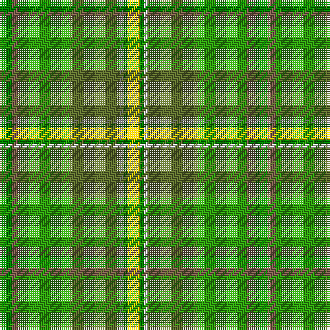

The parent of this is [Braemar House](/tartans/gb/6/lt4/ga24/g24/ln2/gb2/y/6/)

This was sourced from weddslist.  It is a [7 stripes tartan](/stripes/stripes7/).

Original link http://www.weddslist.com/cgi-bin/tartans/pg.pl?source=sts

## Thread count
Gb/6 LT4 Ga24 G24 LN2 Gb2 Y/6

## Palette
Each colour and its ΔE from the base-6 reference it is a variant of.

| Colour | Shade | Base | ΔE (OKLab) |
|---|---|---|---|
| G |  `#607030` | G  | 0.11 |
| Ga |  `#30A010` | G  | 0.19 |
| Gb |  `#008000` | G  | 0.09 |
| LN |  `#E0E0E0` | W  | 0.06 |
| LT |  `#806050` | R  | 0.17 |
| Y |  `#F0C000` | Y  | 0.01 |

# Sample pattern

ID: /variants/gb/6/lt4/ga24/g24/ln2/gb2/y/6-g607030-ga30a010-gb008000-lne0e0e0-lt806050-yf0c000/
