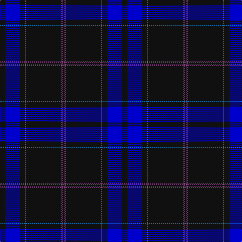

The parent of this is [Gibson, Robert (Personal)](/tartans/k/10/b30/k10/ba2/k70/p2/k/4/)

This was sourced from register-of-tartans.  It is a [7 stripes tartan](/stripes/stripes7/).

Original link https://www.tartanregister.gov.uk/tartanDetails.aspx?ref=11566

## Thread count
K/10 B30 K10 Ba2 K70 P2 K/4

## Palette
Each colour and its ΔE from the base-6 reference it is a variant of.

| Colour | Shade | Base | ΔE (OKLab) |
|---|---|---|---|
| B |  `#0000CD` | B  | 0.15 |
| Ba |  `#1474B4` | B  | 0.15 |
| K |  `#101010` | K  | 0.17 |
| P |  `#B458AC` | R  | 0.20 |

# Sample pattern

ID: /variants/k/10/b30/k10/ba2/k70/p2/k/4-b0000cd-ba1474b4-k101010-pb458ac/
