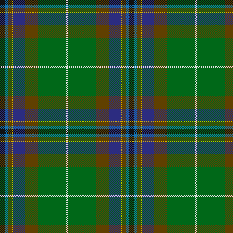

The parent of this is [Teviotdale (District)](/tartans/k/10/b6/t8/y2/db26/t26/g58/ln/4/)

This was sourced from tartans-authority.  It is a [8 stripes tartan](/stripes/stripes8/).

Original link http://www.tartansauthority.com/tartan-ferret/display/5136/

## Thread count
K/10 B6 T8 Y2 DB26 T26 G58 LN/4

## Palette
Each colour and its ΔE from the base-6 reference it is a variant of.

| Colour | Shade | Base | ΔE (OKLab) |
|---|---|---|---|
| B |  `#1474B4` | B  | 0.15 |
| DB |  `#2C2C80` | B  | 0.05 |
| G |  `#006818` | G  | 0.02 |
| K |  `#101010` | K  | 0.17 |
| LN |  `#E0E0E0` | W  | 0.06 |
| T |  `#604000` | G  | 0.14 |
| Y |  `#D8B000` | Y  | 0.05 |

# Sample pattern

ID: /variants/k/10/b6/t8/y2/db26/t26/g58/ln/4-b1474b4-db2c2c80-g006818-k101010-lne0e0e0-t604000-yd8b000/
