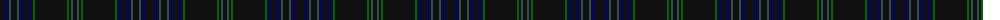

The parent of this is [Dickie (Glasgow)](/tartans/k/10/db2/k2/n2/k6/n2/k2/db2/k6/db2/k2/g2/k32/g2/k2/n2/k/4/)

This was sourced from register-of-tartans.  It is a [17 stripes tartan](/stripes/stripes17/).

Original link https://www.tartanregister.gov.uk/tartanDetails.aspx?ref=10367

## Thread count
K/10 DB2 K2 N2 K6 N2 K2 DB2 K6 DB2 K2 G2 K32 G2 K2 N2 K/4

## Palette
Each colour and its ΔE from the base-6 reference it is a variant of.

| Colour | Shade | Base | ΔE (OKLab) |
|---|---|---|---|
| DB |  `#000080` | B  | 0.14 |
| G |  `#006400` | G  | 0.00 |
| K |  `#101010` | K  | 0.17 |
| N |  `#2F4F4F` | B  | 0.11 |

ID: /variants/k/10/db2/k2/n2/k6/n2/k2/db2/k6/db2/k2/g2/k32/g2/k2/n2/k/4-db000080-g006400-k101010-n2f4f4f/
