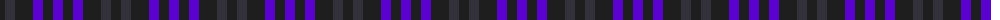

The parent of this is [Charles Rennie Mackintosh](/tartans/k/10/dn10/k18/p10/k10/p/10/)

This was sourced from register-of-tartans.  It is a [6 stripes tartan](/stripes/stripes6/).

Original link https://www.tartanregister.gov.uk/tartanDetails.aspx?ref=10047

## Thread count
K/10 DN10 K18 P10 K10 P/10

## Palette
Each colour and its ΔE from the base-6 reference it is a variant of.

| Colour | Shade | Base | ΔE (OKLab) |
|---|---|---|---|
| DN |  `#32313A` | B  | 0.13 |
| K |  `#1E1E1E` | B  | 0.20 |
| P |  `#5900CE` | B  | 0.15 |

# Sample pattern

ID: /variants/k/10/dn10/k18/p10/k10/p/10-dn32313a-k1e1e1e-p5900ce/
