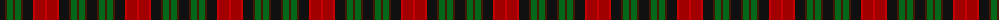

The parent of this is [Murdoch (Dalgliesh)](/tartans/k/10/dr2/g6/dr2/g6/dr2/k10/r2/dra10/r/2/)

This was sourced from register-of-tartans.  It is a [10 stripes tartan](/stripes/stripes10/).

Original link https://www.tartanregister.gov.uk/tartanDetails.aspx?ref=3053

## Thread count
K/10 DR2 G6 DR2 G6 DR2 K10 R2 DRa10 R/2

## Palette
Each colour and its ΔE from the base-6 reference it is a variant of.

| Colour | Shade | Base | ΔE (OKLab) |
|---|---|---|---|
| DR |  `#441800` | B  | 0.22 |
| DRa |  `#A00000` | R  | 0.09 |
| G |  `#006818` | G  | 0.02 |
| K |  `#101010` | K  | 0.17 |
| R |  `#C80000` | R  | 0.00 |

ID: /variants/k/10/dr2/g6/dr2/g6/dr2/k10/r2/dra10/r/2-dr441800-draa00000-g006818-k101010-rc80000/
