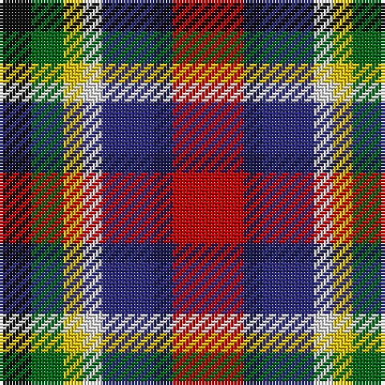

The parent of this is [Nicolson of Taransay Hunting (Personal)](/tartans/k/10/g10/y6/ln6/dba16/db6/r/22/)

This was sourced from register-of-tartans.  It is a [7 stripes tartan](/stripes/stripes7/).

Original link https://www.tartanregister.gov.uk/tartanDetails.aspx?ref=5753

## Thread count
K/10 G10 Y6 LN6 DBa16 DB6 R/22

## Palette
Each colour and its ΔE from the base-6 reference it is a variant of.

| Colour | Shade | Base | ΔE (OKLab) |
|---|---|---|---|
| DB |  `#1C1C50` | B  | 0.14 |
| DBa |  `#2C2C80` | B  | 0.05 |
| G |  `#006818` | G  | 0.02 |
| K |  `#101010` | K  | 0.17 |
| LN |  `#E0E0E0` | W  | 0.06 |
| R |  `#C80000` | R  | 0.00 |
| Y |  `#E8C000` | Y  | 0.00 |

# Sample pattern

ID: /variants/k/10/g10/y6/ln6/dba16/db6/r/22-db1c1c50-dba2c2c80-g006818-k101010-lne0e0e0-rc80000-ye8c000/
