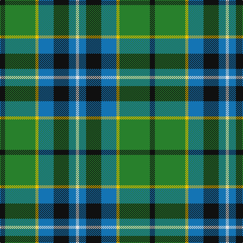

The parent of this is [Dick (Personal)](/tartans/k/10/g60/y6/b30/k30/b14/ln/6/)

This was sourced from tartans-authority.  It is a [7 stripes tartan](/stripes/stripes7/).

Original link http://www.tartansauthority.com/tartan-ferret/display/7183/

## Thread count
K/10 G60 Y6 B30 K30 B14 LN/6

## Palette
Each colour and its ΔE from the base-6 reference it is a variant of.

| Colour | Shade | Base | ΔE (OKLab) |
|---|---|---|---|
| B |  `#1474B4` | B  | 0.15 |
| G |  `#28802C` | G  | 0.09 |
| K |  `#101010` | K  | 0.17 |
| LN |  `#E0E0E0` | W  | 0.06 |
| Y |  `#E8C000` | Y  | 0.00 |

# Sample pattern

ID: /variants/k/10/g60/y6/b30/k30/b14/ln/6-b1474b4-g28802c-k101010-lne0e0e0-ye8c000/
