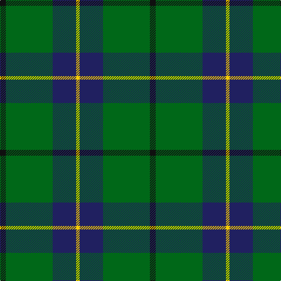

The parent of this is [Byers (Name)](/tartans/k/10/g80/db40/y/6/)

This was sourced from tartans-authority.  It is a [4 stripes tartan](/stripes/stripes4/).

Original link http://www.tartansauthority.com/tartan-ferret/display/10613/

## Thread count
K/10 G80 DB40 Y/6

## Palette
Each colour and its ΔE from the base-6 reference it is a variant of.

| Colour | Shade | Base | ΔE (OKLab) |
|---|---|---|---|
| DB |  `#202060` | B  | 0.11 |
| G |  `#006818` | G  | 0.02 |
| K |  `#101010` | K  | 0.17 |
| Y |  `#FCCC00` | Y  | 0.04 |

# Sample pattern

ID: /variants/k/10/g80/db40/y/6-db202060-g006818-k101010-yfccc00/
