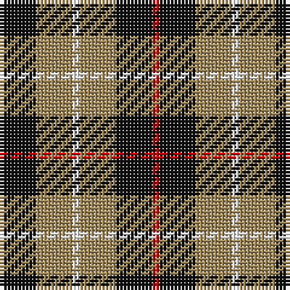

The parent of this is [Canyon County Idaho Sheriff](/tartans/k/10/lt10/w2/lt10/k10/r/2/)

This was sourced from register-of-tartans.  It is a [6 stripes tartan](/stripes/stripes6/).

Original link https://www.tartanregister.gov.uk/tartanDetails.aspx?ref=556

## Thread count
K/10 LT10 W2 LT10 K10 R/2

## Palette
Each colour and its ΔE from the base-6 reference it is a variant of.

| Colour | Shade | Base | ΔE (OKLab) |
|---|---|---|---|
| K |  `#101010` | K  | 0.17 |
| LG |  `#C4BC68` | Y  | 0.07 |
| LT |  `#A08858` | Y  | 0.21 |
| R |  `#C80000` | R  | 0.00 |
| W |  `#F8F8F8` | W  | 0.01 |

# Sample pattern

ID: /variants/k/10/lt10/w2/lt10/k10/r/2-k101010-lgc4bc68-lta08858-rc80000-wf8f8f8/
