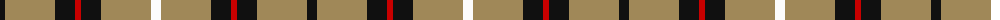

The parent of this is [Richmond de Ellel (Personal)](/tartans/k/10/lt50/k20/r6/k20/lt50/w/10/)

This was sourced from tartans-authority.  It is a [7 stripes tartan](/stripes/stripes7/).

Original link http://www.tartansauthority.com/tartan-ferret/display/6226/

## Thread count
K/10 LT50 K20 R6 K20 LT50 W/10

## Palette
Each colour and its ΔE from the base-6 reference it is a variant of.

| Colour | Shade | Base | ΔE (OKLab) |
|---|---|---|---|
| K |  `#101010` | K  | 0.17 |
| LT |  `#A08858` | Y  | 0.21 |
| R |  `#C80000` | R  | 0.00 |
| W |  `#FCFCFC` | W  | 0.03 |

# Sample pattern

ID: /variants/k/10/lt50/k20/r6/k20/lt50/w/10-k101010-lta08858-rc80000-wfcfcfc/
