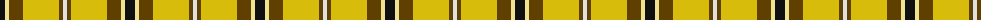
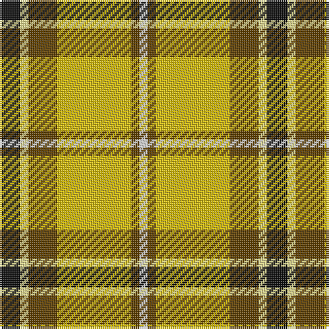

The parent of this is [Shepherd Piping (Personal)](/tartans/k/10/ly4/t14/y36/t4/ln/4/)

This was sourced from tartans-authority.  It is a [6 stripes tartan](/stripes/stripes6/).

Original link http://www.tartansauthority.com/tartan-ferret/display/10160/

## Thread count
K/10 LY4 T14 Y36 T4 LN/4

## Palette
Each colour and its ΔE from the base-6 reference it is a variant of.

| Colour | Shade | Base | ΔE (OKLab) |
|---|---|---|---|
| K |  `#101010` | K  | 0.17 |
| LN |  `#E0E0E0` | W  | 0.06 |
| LY |  `#F0E490` | Y  | 0.11 |
| T |  `#604000` | G  | 0.14 |
| Y |  `#D8BC0C` | Y  | 0.03 |

# Sample pattern

ID: /variants/k/10/ly4/t14/y36/t4/ln/4-k101010-lne0e0e0-lyf0e490-t604000-yd8bc0c/
