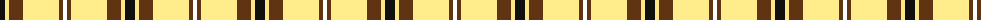
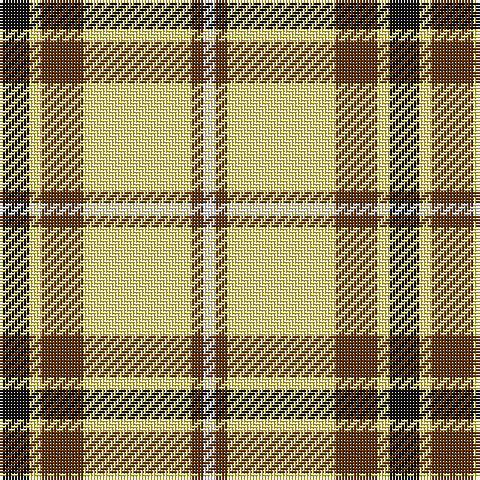

The parent of this is [Shepherd, Derek (Piping)](/tartans/k/10/lya4/t14/ly36/t4/w/4/)

This was sourced from register-of-tartans.  It is a [6 stripes tartan](/stripes/stripes6/).

Original link https://www.tartanregister.gov.uk/tartanDetails.aspx?ref=10160

## Thread count
K/10 LYa4 T14 LY36 T4 W/4

## Palette
Each colour and its ΔE from the base-6 reference it is a variant of.

| Colour | Shade | Base | ΔE (OKLab) |
|---|---|---|---|
| K |  `#101010` | K  | 0.17 |
| LY |  `#FFEC8B` | W  | 0.12 |
| LYa |  `#FEE885` | Y  | 0.12 |
| T |  `#603311` | G  | 0.18 |
| W |  `#FFFFFF` | W  | 0.03 |

# Sample pattern

ID: /variants/k/10/lya4/t14/ly36/t4/w/4-k101010-lyffec8b-lyafee885-t603311-wffffff/
