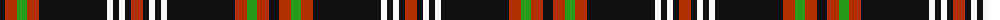

The parent of this is [Woodberry Forest School (Corporate)](/tartans/k/10/r12/g10/r12/k68/w6/k6/w6/k6/r/12/)

This was sourced from tartans-authority.  It is a [10 stripes tartan](/stripes/stripes10/).

Original link http://www.tartansauthority.com/tartan-ferret/display/6851/

## Thread count
K/10 R12 G10 R12 K68 W6 K6 W6 K6 R/12

## Palette
Each colour and its ΔE from the base-6 reference it is a variant of.

| Colour | Shade | Base | ΔE (OKLab) |
|---|---|---|---|
| G |  `#289C18` | G  | 0.18 |
| K |  `#101010` | K  | 0.17 |
| R |  `#B03000` | R  | 0.05 |
| W |  `#F8F8F8` | W  | 0.01 |

ID: /variants/k/10/r12/g10/r12/k68/w6/k6/w6/k6/r/12-g289c18-k101010-rb03000-wf8f8f8/
