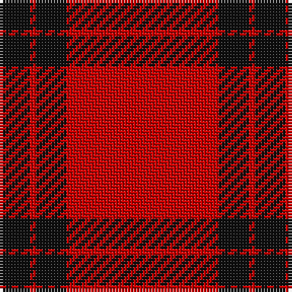

The parent of this is [Masai Shuka 12 (Artefact)](/tartans/k/10/r2/k10/r/50/)

This was sourced from tartans-authority.  It is a [4 stripes tartan](/stripes/stripes4/).

Original link http://www.tartansauthority.com/tartan-ferret/display/7202/

## Thread count
K/10 R2 K10 R/50

## Palette
Each colour and its ΔE from the base-6 reference it is a variant of.

| Colour | Shade | Base | ΔE (OKLab) |
|---|---|---|---|
| K |  `#101010` | K  | 0.17 |
| R |  `#C80000` | R  | 0.00 |

# Sample pattern

ID: /variants/k/10/r2/k10/r/50-k101010-rc80000/
