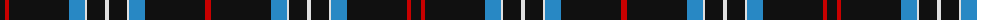

The parent of this is [Glasgow Caledonian University Corporate Tartan Tartan Number: 2418. Earliest known date: pre 1998 Estimated thread count for display purposes only. See products available Copyright © Blair Urquhart, Comrie, 2015](/tartans/k/10/r4/k60/b16/ln2/k18/ln4/k18/ln2/b16/k60/r/6/)

This was sourced from house-of-tartan.  It is a [12 stripes tartan](/stripes/stripes12/).

Original link http://www.house-of-tartan.scotland.net/house/TartanViewjs.asp?colr=Def&tnam=2418

## Thread count
K/10 R4 K60 B16 LN2 K18 LN4 K18 LN2 B16 K60 R/6

## Palette
Each colour and its ΔE from the base-6 reference it is a variant of.

| Colour | Shade | Base | ΔE (OKLab) |
|---|---|---|---|
| B |  `#2888C4` | B  | 0.21 |
| K |  `#101010` | K  | 0.17 |
| LN |  `#E0E0E0` | W  | 0.06 |
| R |  `#C80000` | R  | 0.00 |

ID: /variants/k/10/r4/k60/b16/ln2/k18/ln4/k18/ln2/b16/k60/r/6-b2888c4-k101010-lne0e0e0-rc80000/
