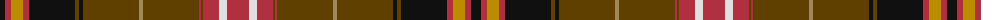

The parent of this is [Scottish Register of Tartans (Corp)](/tartans/k/10/r6/dy12/r6/k46/t4/k4/t56/lt4/t56/r2/t2/r16/ln8/r/22/)

This was sourced from tartans-authority.  It is a [15 stripes tartan](/stripes/stripes15/).

Original link http://www.tartansauthority.com/tartan-ferret/display/10000/

## Thread count
K/10 R6 DY12 R6 K46 T4 K4 T56 LT4 T56 R2 T2 R16 LN8 R/22

## Palette
Each colour and its ΔE from the base-6 reference it is a variant of.

| Colour | Shade | Base | ΔE (OKLab) |
|---|---|---|---|
| DY |  `#BC8C00` | Y  | 0.16 |
| K |  `#101010` | K  | 0.17 |
| LN |  `#E0E0E0` | W  | 0.06 |
| LT |  `#A08858` | Y  | 0.21 |
| R |  `#B03040` | R  | 0.06 |
| T |  `#604000` | G  | 0.14 |

ID: /variants/k/10/r6/dy12/r6/k46/t4/k4/t56/lt4/t56/r2/t2/r16/ln8/r/22-dybc8c00-k101010-lne0e0e0-lta08858-rb03040-t604000/
